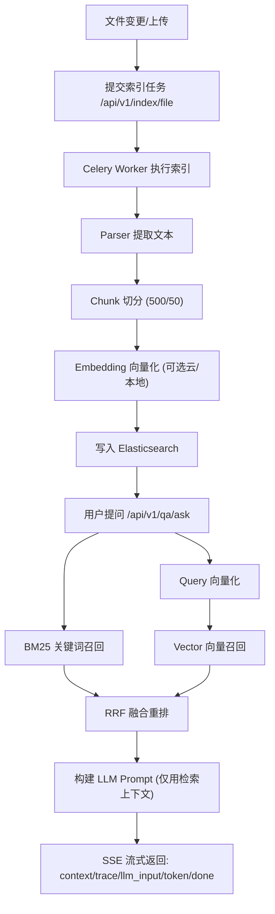

# Everything-Ent-Hybrid（企业知识库 RAG）

本项目是一个企业级知识库 RAG 系统，支持：
- FastAPI + Celery + Elasticsearch 的异步索引与检索
- BM25 + 向量召回 + RRF 融合
- Qwen（OpenAI 兼容接口）LLM 与 Embedding
- Docker 一键运行

## 如何运行（最简）

### 1. 准备环境变量

```bash
cp .env.example .env
```

至少建议配置：
- `LLM_API_KEY`（用于生成回答）
- `DASHSCOPE_API_KEY`（使用云端 embedding 时需要）

### 2. 启动服务

```bash
docker compose up --build -d
```

### 3. 健康检查

```bash
curl http://localhost:18000/health
```

### 4. 打开前端

- 前端地址：`http://localhost:5173`
- API 地址：`http://localhost:18000`

---

## RAG 流程（详细）

下面是系统从“文档进入”到“答案返回”的完整链路。



### 一、索引链路（让系统“读懂文档”）

1. 文档进入系统
- 来源可以是：文件监听（watcher）检测到变更，或手动调用索引接口。
- 入口接口：`POST /api/v1/index/file`

2. 异步任务解耦
- API 仅负责校验与入队，不阻塞主线程。
- Celery Worker 从 Redis 队列消费任务，执行真实索引。

3. 文本解析（Parser）
- 按文件类型提取可检索文本（如 `.md/.txt/.pdf/.docx`）。
- 目标是把原始文档统一转换为纯文本。

4. 文本切分（Chunk）
- 当前默认参数：`CHUNK_SIZE=500`、`CHUNK_OVERLAP=50`。
- 策略是滑动窗口切分，步长为 `500-50=450`。
- 作用：
  - 降低单次 embedding 与检索粒度
  - 保留上下文重叠，减少答案断裂

5. 向量化（Embedding）
- 对每个 chunk 生成向量（若 `INDEX_WITH_VECTORS=true`）。
- 支持云端和本地模式：
  - 云端：DashScope OpenAI-compatible
  - 本地：兼容 OpenAI 接口或 sentence-transformers

6. 写入 Elasticsearch
- 每个 chunk 形成一条索引文档，关键字段包含：
  - `doc_id`（唯一ID）
  - `file_path` / `file_name`
  - `content`（文本）
  - `vector`（向量，可选）
  - `chunk_id` / `mtime`
- 写入前会按 `file_path` 清理旧版本，实现增量更新。

7. 分词器生效点
- 入索引分词器：`analyzer`
- 查询分词器：`search_analyzer`
- 常见配置：
  - IK 方案：`ik_max_word`（索引） + `ik_smart`（查询）
  - standard 方案：`standard`（索引/查询）

### 二、查询链路（让系统“答对问题”）

1. 用户提问
- 入口接口：`POST /api/v1/qa/ask`
- 请求可带 `debug=true`，返回完整检索链路信息。

2. Query 向量化
- 将问题编码为向量，供向量召回使用。

3. 双路并行召回
- 路 A：BM25 关键词召回（适合术语、错误码、精确词）
- 路 B：向量召回（适合同义表达、语义近似）
- 两路并发执行，减少整体延迟。

4. RRF 融合重排
- 对两路结果做倒数排名融合：`1 / (k + rank)`。
- 融合后取 `Top-K final` 作为最终上下文。
- 价值：兼顾关键词精确性与语义覆盖率。

5. 构建 LLM 输入
- 仅把 Top-K chunk 作为上下文拼进 Prompt。
- 系统约束模型：只基于检索内容回答，减少幻觉。
- 同时保留引用来源（文档名、路径、chunk 编号）。

6. 生成与流式输出（SSE）
- 事件顺序通常是：
  - `context`：返回引用与上下文数量
  - `trace`：返回召回、融合、耗时、候选流转
  - `llm_input`：返回送入模型的完整 messages/contexts
  - `token`：流式回答 token
  - `done`：回答结束

### 三、前端可视化看到什么

前端可直接看到每一步输入/输出，重点包括：
- 是否入库、chunk 数量
- BM25 命中、向量命中、融合命中
- overlap/union/fusion_gain
- 各阶段耗时（embedding、search、fusion、total）
- 传给大模型的完整上下文
- 最终回答及引用来源

### 四、IK vs standard 对比在流程中的位置

当你做分词 A/B 时，变化只在 BM25 这一路：
- IK 与 standard 会影响“关键词召回”排序与命中
- dense 向量召回本身不依赖分词器
- fusion 结果会间接受影响（因为 BM25 候选变了）

---

## 常用运行命令

```bash
# 查看服务状态
docker compose ps

# 查看 API 日志
docker compose logs -f api

# 查看 Worker 日志
docker compose logs -f worker

# 重建前端
docker compose build frontend && docker compose up -d --force-recreate frontend
```
